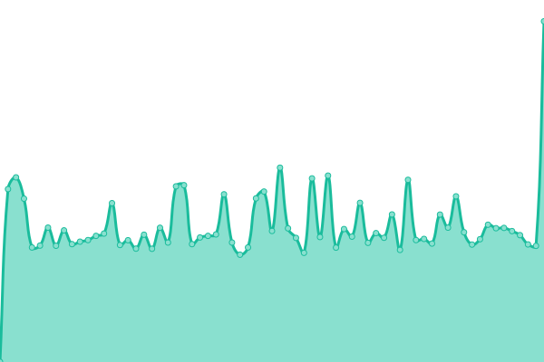
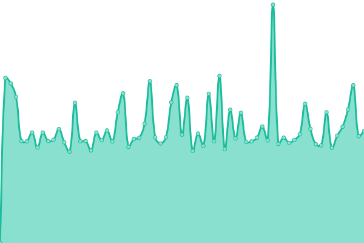
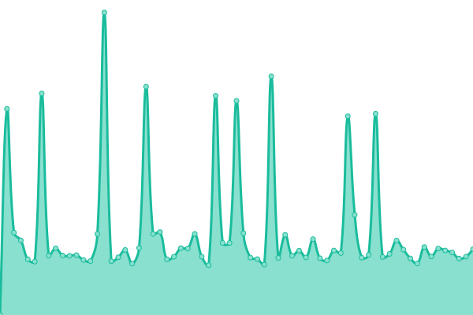

# [📈 Live Status](https://upptime.github.io/upptime): <!--live status--> **🟩 All systems operational**

This repository contains the open-source uptime monitor and status page for [Upptime](https://upptime.js.org), powered by [Upptime](https://github.com/upptime/upptime).

With [Upptime](https://upptime.js.org), you can get your own unlimited and free uptime monitor and status page, powered entirely by a GitHub repository. We use [Issues](https://github.com/upptime/upptime/issues) as incident reports, [Actions](https://github.com/blacky1707/uptime/actions) as uptime monitors, and [Pages](https://upptime.github.io/upptime) for the status page.

<!--start: status pages-->
<!-- This summary is generated by Upptime (https://github.com/upptime/upptime) -->
<!-- Do not edit this manually, your changes will be overwritten -->
<!-- prettier-ignore -->
| URL | Status | History | Response Time | Uptime |
| --- | ------ | ------- | ------------- | ------ |
|  [WSMM](https://www.wsmm.de) | 🟩 Up | [wsmm.yml](https://github.com/blacky1707/uptime/commits/HEAD/history/wsmm.yml) | 

 1462ms
     
 | 

<a href="https://blacky1707.github.io/uptime/history/wsmm">60.95%</a>
    

|  [Auktionshaus am See](https://www.auktionshausamsee.de) | 🟩 Up | [auktionshaus-am-see.yml](https://github.com/blacky1707/uptime/commits/HEAD/history/auktionshaus-am-see.yml) | 

 1090ms
     
 | 

<a href="https://blacky1707.github.io/uptime/history/auktionshaus-am-see">60.95%</a>
    

|  [Bilali Motoreninstandsetzung](https://www.bilali-motoreninstandsetzung.de) | 🟩 Up | [bilali-motoreninstandsetzung.yml](https://github.com/blacky1707/uptime/commits/HEAD/history/bilali-motoreninstandsetzung.yml) | 

 1228ms
     
 | 

<a href="https://blacky1707.github.io/uptime/history/bilali-motoreninstandsetzung">60.96%</a>
    

|  [Carpoint Botnang](https://www.carpoint-botnang.de) | 🟩 Up | [carpoint-botnang.yml](https://github.com/blacky1707/uptime/commits/HEAD/history/carpoint-botnang.yml) | 

 678ms
     
 | 

<a href="https://blacky1707.github.io/uptime/history/carpoint-botnang">60.97%</a>
    

|  [Finanzberatung Timo Strangfeld](https://www.finanzberatung-bw.de) | 🟩 Up | [finanzberatung-timo-strangfeld.yml](https://github.com/blacky1707/uptime/commits/HEAD/history/finanzberatung-timo-strangfeld.yml) | 

 1033ms
     
 | 

<a href="https://blacky1707.github.io/uptime/history/finanzberatung-timo-strangfeld">60.97%</a>
    

|  [Hannah Crasser](https://www.kosmetik-ostfildern.de) | 🟩 Up | [hannah-crasser.yml](https://github.com/blacky1707/uptime/commits/HEAD/history/hannah-crasser.yml) | 

 1685ms
     
 | 

<a href="https://blacky1707.github.io/uptime/history/hannah-crasser">60.98%</a>
    

|  [Zahnärzte Krauss](https://www.zahnaerzte-krauss.de) | 🟩 Up | [zahnaerzte-krauss.yml](https://github.com/blacky1707/uptime/commits/HEAD/history/zahnaerzte-krauss.yml) | 

 1671ms
     
 | 

<a href="https://blacky1707.github.io/uptime/history/zahnaerzte-krauss">60.63%</a>
    

|  [Parfümerie Albrecht](https://www.pal1732.de) | 🟩 Up | [parfuemerie-albrecht.yml](https://github.com/blacky1707/uptime/commits/HEAD/history/parfuemerie-albrecht.yml) | 

 1782ms
     
 | 

<a href="https://blacky1707.github.io/uptime/history/parfuemerie-albrecht">60.98%</a>
    

<!--end: status pages-->

[**Visit our status website →**](https://upptime.github.io/upptime)

## 📄 License

- Powered by: [Upptime](https://github.com/upptime/upptime)
- Code: [MIT](./LICENSE) © [Upptime](https://upptime.js.org)
- Data in the `./history` directory: [Open Database License](https://opendatacommons.org/licenses/odbl/1-0/)
